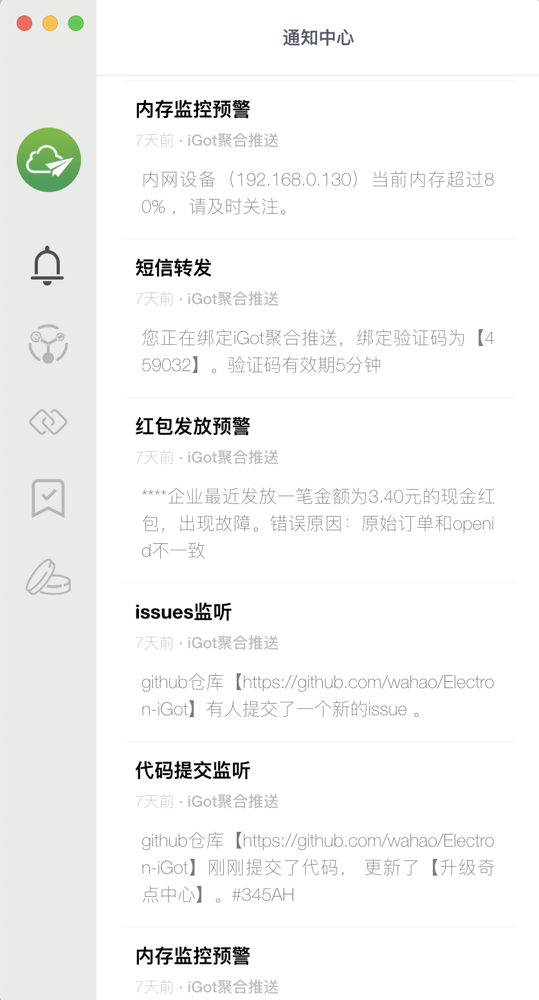
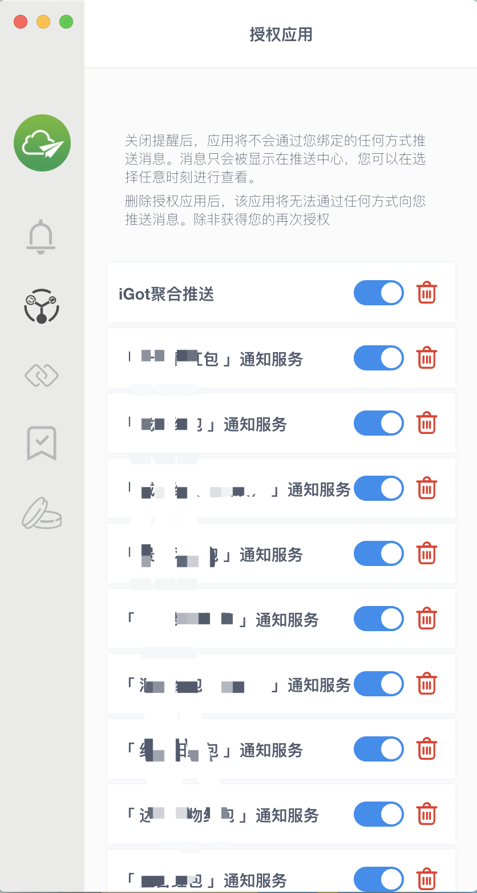
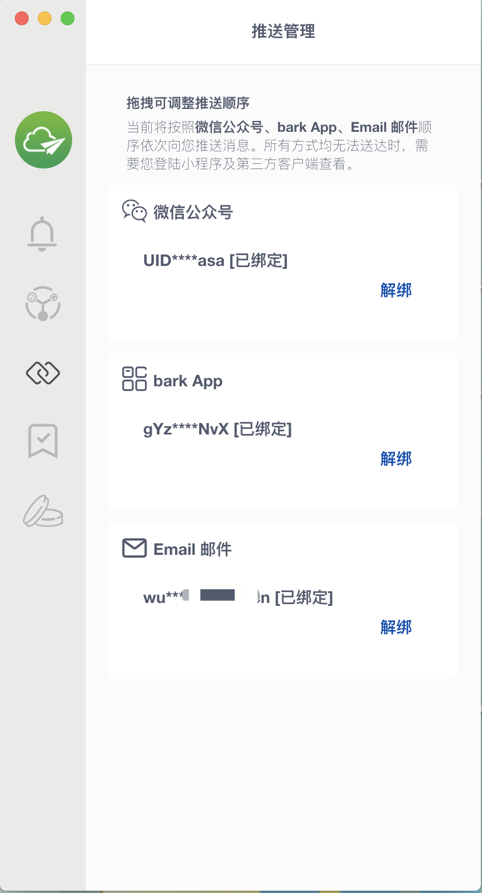
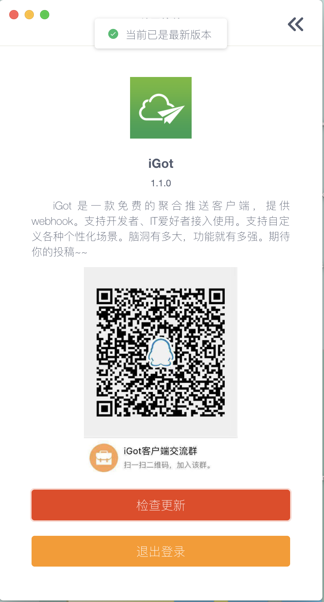
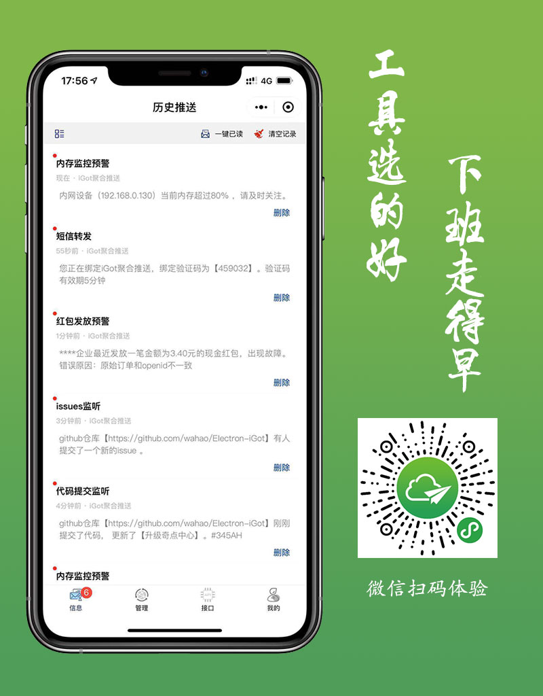

# Electron iGot

* 一款聚合微信、邮箱、app推送的桌面消息管理客户端 。 基于 [Electron](https://github.com/atom/electron) 构建 。 

api接口由[iGot开放接口](https://wahao.github.io/Bark-MP-helper/#/zh-cn/)提供。

> iGot客户端是基于[iGot小程序](https://github.com/wahao/Bark-MP-helper)衍生的桌面客户端项目。您可以通过iGot轻松管理消息和您的推送方式。通过一行代码请求您就可以自定义向自己或项目组成员推送相关信息。
>

## 软件预览图



## 您可以用它来做

- 短信转发
- 服务器内存、CPU预警监控、 进程监听
- 项目业务的预警
- 内部服务提醒
- .....



> **SPECIAL THANKS TO | 特别感谢**
> 
> Electron-iGot基于以下项目提供的服务构建，
>
> [electron-vue](https://github.com/SimulatedGREG/electron-vue) An Electron & Vue.js quick start boilerplate with vue-cli scaffolding, common Vue plugins, electron-packager/electron-builder, unit/e2e testing, vue-devtools, and webpack.
>
> [Bark](https://github.com/Finb/Bark) Bark is an iOS App which allows you to push customed notifications to your iPhone.
>
> [WxPusher](https://github.com/zjiecode/wxpusher-docs) WxPusher (微信推送服务)是一个使用微信公众号作为通道的，实时信息推送平台，你可以通过调用API的方式，把信息推送到微信上，无需安装额外的软件，即可做到信息实时通知。 你可以使用WxPusher来做服务器报警通知、抢课通知、抢票通知，信息更新提示等。
>
> [iGot](https://github.com/wahao/Bark-MP-helper) iGot 是微信小程序端Bark插件，同时扩展邮箱及微信推送，实现聚合推送能力。支持历史推送数据的记录和查看功能。
>

## Features

- **支持推送消息实时提醒、管理**
- **可创建一对多的订阅链接（订阅号）**
- **可绑定推送方式、可自定义推送顺序**
- 支持管理授权应用
- 支持奇点管理和兑换

## How To Use

To clone and run this repository you'll need [Git](https://git-scm.com) and [Node.js](https://nodejs.org/en/download/) (which comes with [npm](https://www.npmjs.com/)) installed on your computer. From your command line:

``` bash
# Clone this repository
git clone https://github.com/wahao/Electron-iGot.git
# Go into the repository
cd Electron-iGot
# Install dependencies and run the app
npm install && npm run dev
```

To pack into an app

``` shell
npm run build
```

#### [下载 | Download Released App](https://github.com/wahao/Electron-iGot/releases)

#### License [MIT](LICENSE.md)
